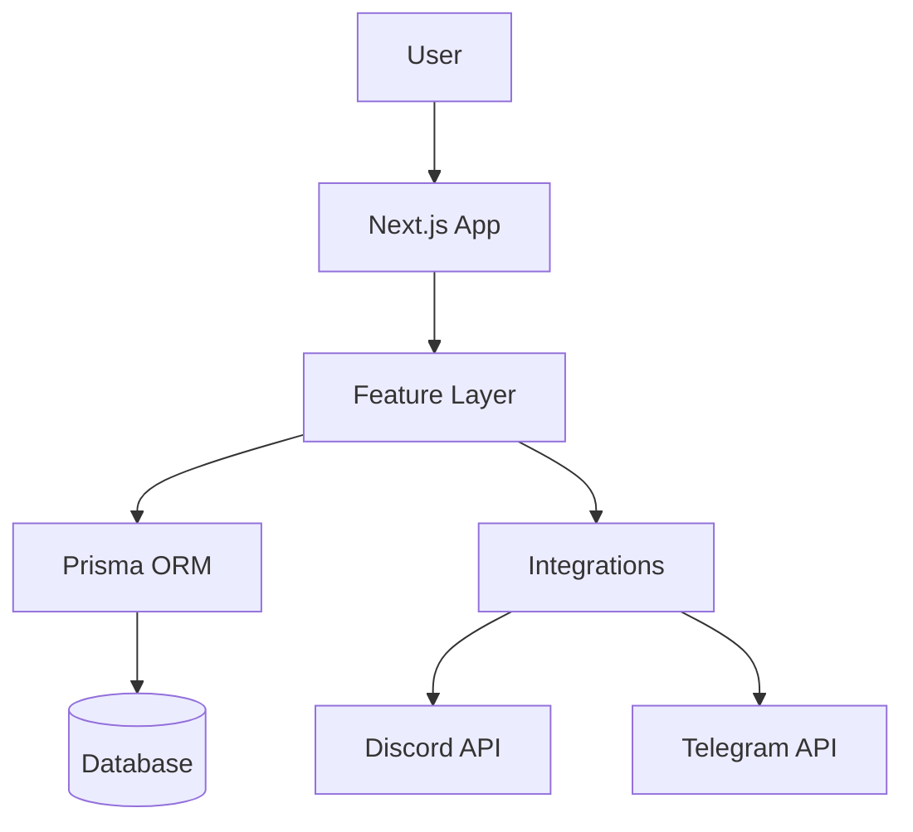

# Architecture

> Auto-generated by /map on 2026-01-20

## Overview

Tabletop Scheduler is a web application designed to coordinate game sessions. It uses a "Feature Sliced" architectural pattern to organize code by business domain rather than technical function. The system supports two modes: **Hosted** (Vercel + Postgres) and **Self-Hosted** (Docker + SQLite).

## Components

### Features
The `features/` directory contains the core business logic, sliced vertically:

- **auth**: Handles user authentication via Magic Links and Manager Recovery flows. The system is largely "accountless" for participants, using tokens.
- **event-management**: Core logic for creating events, proposing times, and finalizing schedules.
- **discord**: Discord integration logic (webhooks, bot interactions).
- **telegram**: Telegram integration logic (webhooks, bot interactions).
- **integrations**: General integration patterns.

### Application Layer
The `app/` directory uses the Next.js App Router:
- **api/**: specific API routes for webhooks (`telegram`, `auth`, `cron`).
- **new/**: Event creation wizard.
- **e/[slug]/**: Public event pages.
- **e/[slug]/manage**: Admin management interface.

## Data Flow

1. **Event Creation**: User fills form -> `Event` created in DB with `adminToken`.
2. **Participation**: User votes on slots -> `Vote` and `Participant` records created.
3. **Notification**: System triggers `WebhookEvent` -> Processed by `shared/lib/webhook-sender.ts` -> Sent to Discord/Telegram.
4. **Finalization**: Admin selects slot -> `Event` status updated -> Final notifications sent.

## Integration Points

| Service | Type | Purpose |
|---------|------|---------|
| Telegram | Webhook | Bot interaction, notifications, user recovery |
| Discord | Webhook | Notifications, eventual bot updates |
| Vercel | Hosting | Output destination for hosted mode |
| Docker | Hosting | Output destination for self-hosted mode |

## Technical Debt

- [ ] "Workers undefined" runtime error seen in `STATE.md` (marked mostly resolved).
- [ ] Strict TypeScript compliance (current goal in `SPEC.md`).
- [ ] Ensure all `import`s of Server Actions are static to avoid build manifest errors.

## Privacy & Visibility Architecture (Privacy Integration)

This system implements a strict **"Privacy via Architecture"** policy (Ref: ADR-001).

### The Visibility Split
| Surface Area | Content Type | Visibility | Mechanism |
|--------------|--------------|------------|-----------|
| **Marketing** | Landing, Blog, FAQ | **Public** | `sitemap.xml`, `robots.txt` Allow |
| **Application** | Events (`/e/*`), Admin | **Private** | `noindex` Header, `robots.txt` Disallow |

This ensures that while the **Tool** is visible to AI Agents (AEO), the **User's Data** is cryptographically (token) and architecturally (noindex) hidden.

## Conventions

- **Naming**: camelCase for vars, PascalCase for components.
- **Structure**: `features/[feature]/[segment]` (ui, server, model).
- **Testing**: Vitest for unit tests.
